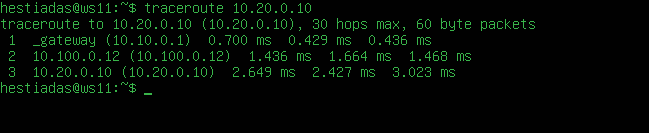

## Part 1. Инструмент ipcalc

### 1.1. Сети и маски

1. Адрес сети **192.167.38.54/13** 
   - **192.160.0.0**
2.  Перевод масок:   
    - Маска **255.255.255.0**  
   в префиксной записи выглядит как **/24**  
   в двоичной записи выглядит как  **11111111.11111111.11111111.00000000**  
    - Маска  **/15**  
   в двоичной записи выглядит как  **11111111.11111110.00000000.00000000**  
   в обычной записи выглядит как **255.254.0.0**  
    - Маска  **11111111.11111111.11111111.11110000**  
   в обычной записи выглядит как **255.255.255.240**   
   в префиксной записи выглядит как **/28**     
3. Минимальный и максимальный хост в сети **12.167.38.4**  
    - при маске **/8**   
      HostMin: **12.0.0.1**  
      HostMax: **12.255.255.254**  
    - при маске **11111111.11111111.00000000.00000000**  
      HostMin: **12.167.0.1**  
      HostMax: **12.167.255.254**  
    - при маске **255.255.254.0**  
      HostMin: **12.167.38.1**  
      HostMax: **12.167.39.254**  
    - при маске **/4**  
      HostMin: **0.0.0.1**  
      HostMax: **15.255.255.254**  

### 1.2. localhost

- Обратиться к приложению, работающему на localhost, возможно со следующими IP:  
   **127.0.0.2**  
   **127.1.0.1**    
   Эти адреса не будут работать для обращения к приложению, работающему на localhost:  
   **194.34.23.100**  
   **128.0.0.1**  

### 1.3. Диапазоны и сегменты сетей
1. какие из перечисленных IP можно использовать в качестве публичного, а какие только в качестве частных:  
- частные:  
   - **10.0.0.45**  
   - **192.168.4.2**  
   - **172.20.250.4**  
   - **172.16.255.255**
   - **10.10.10.10**
- публичные:
   - **134.43.0.2**
   - **172.0.2.1**
   - **192.172.0.1**
   - **172.68.0.2**
   - **192.169.168.1**

2. какие из перечисленных IP адресов шлюза возможны у сети **`10.10.0.0/18`** ?
- возможны:
    - **10.10.0.2**, **10.10.10.10**, **10.10.1.255**
- не возможны:
    - **10.0.0.1**, **10.10.100.1**

## Part 2. Статическая маршрутизация между двумя машинами  
- Просматриваем существующие сетевые интерфейсы на обеих машинах с помощью команды ***ip a***:  
     
  
- Изменяем файл **`etc/netplan/00-installer-config.yaml`** для каждой машины. Для применения изменений в сетевой конфигурации, определенной в файлах конфигурации Netplan (в нашем случае в файл) используем команду ***`netplan apply`***.  
Машина **ws1** находится в сети **192.168.0.0** с маской подсети **/16**:  
    
Машина ws2 находится в сети **172.16.0.0** с маской подсети **/12**:  
    

### 2.1. Добавление статического маршрута вручную
Для того чтобы настроить маршрут между сетью **192.168.0.0/16** и сетью, в которой находится компьютер **ws2** с IP-адресом **172.24.116.8**, используем команду ***`ip route add [назначение] via [шлюз]`*** для добавления маршрута на компьютере **ws1**. Для отображения текущих маршрутов в сетевой таблице используем команду ***`ip r`***, или полностью ***`ip route`***. Затем проверяем доступность и связь между вашим компьютером ws1 и устройством с IP-адресом **172.24.116.8** (в данном случае, компьютер **ws2**) в нашей сети. После чего перезапускаем систему.  Такие же действие проделываем для второй машины (**ws2**) только манипулируя другими значениями.

  
  

### 2.2. Добавление статического маршрута с сохранением
Для того чтобы настроить маршрут между сетью **192.168.0.0/16** и сетью, в которой находится компьютер **ws2** с IP-адресом **172.24.116.8** с сохранением, изменяем файл конфигурации **`etc/netplan/00-installer-config.yaml`**. Это более постоянный способ настройки маршрута, так как изменения в файле конфигурации сохраняются и применяются при каждой загрузке системы. Для применения изменений в сетевой конфигурации, определенной в файлах конфигурации Netplan (в нашем случае в файле **`etc/netplan/00-installer-config.yaml`**) используем команду ***`netplan apply`***. Затем проверяем доступность и связь между вашим компьютером ws1 и устройством с IP-адресом 172.24.116.8 (в данном случае, компьютер **ws2**) в нашей сети. Такие же действие проделываем для второй машины (**ws2**) только манипулируя другими значениями.

  
  

## Part 3. Утилита iperf3

### 3.1. Скорость соединения

#### Конвертация единиц измерения скорости передачи данных:

- 8 Mbps в MB/s:
Для этого нам нужно разделить скорость в мегабитах в секунду (Mbps) на 8, так как 1 байт (B) состоит из 8 бит (b).
8 Mbps / 8 = 1 MB/s
Ответ: 8 Mbps равно 1 MB/s.

- 100 MB/s в Kbps:
Для этого нам нужно умножить скорость в мегабайтах в секунду (MB/s) на 1000, так как 1 мегабайт (MB) состоит из 1000 килобайт (KB).
100 MB/s * 1000 = 100,000 Kbps
Ответ: 100 MB/s равно 100,000 Kbps.

- 1 Gbps в Mbps:
Для этого нам нужно умножить скорость в гигабитах в секунду (Gbps) на 1000, так как 1 гигабит (Gbps) состоит из 1000 мегабит (Mbps).
1 Gbps * 1000 = 1000 Mbps
Ответ: 1 Gbps равно 1000 Mbps.

### 3.2. Утилита iperf3

На одном из устройств (**ws1**), запускаем **iperf3** в режиме сервера, чтобы он слушал входящие соединения. 
На другом устройстве (**ws2**), запускаем **iperf3** в режиме клиента и указываем IP-адрес **ws1** в качестве целевого сервера, чтобы отправить данные на сервер и измерить скорость.  
  
  

## Part 4. Сетевой экран

### 4.1. Утилита iptables
Создаем файл /etc/firewall.sh, имитирующий фаерволл, на **ws1** и **ws2**. Затем запускаем файлы на обеих машинах командами ***`chmod +x /etc/firewall.sh`*** и ***`/etc/firewall.sh`***:  
  
  
Так как утилита **iptabels** выполняет первое прочитанное правило, разница между стратегиями заключается в порядке команд. Для машины **ws1** первой стоит команда **REJECT** - отклонить пакет. Будет выполнятся этот запрет и пинг не пройдет. Для машины **ws2** напротив, первым стоит **ACCEPT** - разрешить прохождение пакета. Пинг проходит.

### 4.2. Утилита nmap
Команда **`ping`** и запуск утилиты **nmap** для **ws2**, т.к. **ws1** теперь не пингуется из-за **`firewall.sh`**  
*Проверка: в выводе nmap должно быть сказано:* ***Host is up***  
  

## Part 5. Статическая маршрутизация сети

### 5.1. Настройка адресов машин
Конфигурации машин в **`etc/netplan/00-installer-config.yaml`**:  
- **r1**  
  
- **r2**  
  
- **ws11**  
  
- **ws21**  
  
- **ws22**  
  

Проверка командой ***`ip -4 a`***  что адрес каждой машины задан верно:

- **r1**  
  
- **r2**  
  
- **ws11**  
  
- **ws21**  
  
- **ws22**  
  

- Пинг **ws22** -> **ws21**.  
  
- Пинг **r1** -> **ws11**.  
  

### 5.2. Включение переадресации IP-адресов.

Вызов команды ***`sysctl -w net.ipv4.ip_forward=1`*** и с содержание изменённого файла **`/etc/sysctl.conf`** для обеих машин:
- **r1**  
  
- **r2**  
  

### 5.3. Установка маршрута по-умолчанию

Настраиваем маршрут по-умолчанию (шлюз) для рабочих станций. Для этого добавить **default** перед IP роутера в файле конфигураций. Для отображения текущих маршрутов в сетевой таблице используем команду ***`ip r`***, или полностью ***`ip route`***. 
- **ws11**  
  
- **ws21**  
  
- **ws22**  
  

Запускаем команду ***tcpdump -tn -i eth1*** для мониторинга сетевого трафика:  
  

Пропинговываем с **ws11** роутер **r2**:  
   

### 5.4. Добавление статических маршрутов

Конфигурации машин в **`etc/netplan/00-installer-config.yaml`** и вызов ***`ip r`*** чтобы показать таблицы с маршрутами на обоих роутерах.
- **r1**  
  
- **r2**  
  

Запуск команды ***`vip r list 10.10.0.0/[маска сети]`*** и ***`ip r list 0.0.0.0/0`***  на **ws11**  :

  

Для адреса **10.10.0.0/18** был выбран более конкретный маршрут, чем маршрут по умолчанию (**0.0.0.0/0**). Маршрут с более длинной маской подсети (**10.10.0.0/18**) имеет более высокий приоритет и предпочтительнее для доставки трафика к этой конкретной подсети. Маршрут **0.0.0.0/0** используется в случае, когда нет конкретных маршрутов для отправки пакета в определенное место.

### 5.5. Построение списка маршрутизаторов

Запустить на **r1** команду дампа: ***`tcpdump -tnv -i eth0`***  
  
При помощи утилиты **traceroute** построим список маршрутизаторов на пути от **ws11** до **ws21**:  
  

#### Принцип работы построения пути с помощью traceroute следующий:

- Исходный узел (компьютер, с которого запускается traceroute) отправляет серии ICMP (или UDP) пакетов к целевому узлу с инкрементирующимися значениями TTL (Time-to-Live), начиная с 1. TTL - это поле в заголовке IP-пакета, которое ограничивает количество "прыжков" (или узлов) между маршрутизаторами, которые может совершить пакет, прежде чем он будет отброшен.

- Первый пакет (с TTL = 1) отправляется к ближайшему маршрутизатору на пути к целевому узлу. Когда маршрутизатор получает пакет с TTL = 1, он уменьшает TTL до 0 и отбрасывает пакет. Затем маршрутизатор отправляет уведомление о "времени превышено" (Time Exceeded) обратно отправителю.

- Исходный узел получает это уведомление и записывает информацию о маршрутизаторе, который обработал пакет, а также измеряет задержку до этого маршрутизатора.

- Затем процедура повторяется, увеличивая TTL на 1. Это позволяет пакету дойти до следующего маршрутизатора на пути, и таким образом, каждый маршрутизатор на пути к целевому узлу записывается.

- Процесс повторяется до тех пор, пока пакет не достигнет целевого узла. Когда это произойдет, целевой узел отправит ответ, и traceroute завершит выполнение.

### 5.6. Использование протокола ICMP при маршрутизации

Запускаем на **r1** перехват сетевого трафика, проходящего через eth0 с помощью команды: ***`tcpdump -n -i eth0 icmp`***  
  
  

Пропинговываем с **ws11** несуществующий IP (например, 10.30.0.111):  
  

## Part 6. Динамическая настройка IP с помощью DHCP

Для r2 настраиваем в файле ***`/etc/dhcp/dhcpd.conf`*** конфигурацию службы DHCP, в файле ***`resolv.conf`*** прописываем nameserver 8.8.8.8, перезагружаем службу DHCP командой ***`systemctl restart isc-dhcp-server`***.  
    
  

Машину **ws21** перезагружаем при помощи reboot и через ***`ip a`*** показываем, что она получила адрес.   
- До:  
  
- После:  
  

Указываем MAC адрес у **ws11** в etc/netplan/00-installer-config.yaml  
  

Для **r1** настроить аналогично **r2**, но сделать выдачу адресов с жесткой привязкой к MAC-адресу (**ws11**).  
  
  

Измененный ip на машине **ws11** после:  
  

Запрашиваем с **ws21** обновление ip адреса  
  
***dhclient -v*** - получение нового ip; ***dhclient -r*** - удаление старых (всех) ip;

## Part 7. NAT

В файле ***`/etc/apache2/ports.conf`*** на **ws22** и **r1** изменяем строку **Listen 80** на **Listen 0.0.0.0:80**, то есть делаем сервер Apache2 общедоступным, затем запускаем веб-сервер Apache командой ***`service apache2 start`*** на **ws22** и **r1**  
  
  

Добавляем в фаервол на **r2** следующие правила:  
1) удаление правил в таблице filter - iptables -F
2) удаление правил в таблице "NAT" - iptables -F -t nat
3) отбрасывать все маршрутизируемые пакеты - iptables --policy FORWARD DROP  
  
Проверяем соединение между **ws22** и **r1** командой ***`ping`***, при запуске файла с этими правилами, **ws22** не должна "пинговаться" с **r1**, что мы и наблюдаем:  
  

Добавляем в файл ещё одно правило:
- разрешить маршрутизацию всех пакетов протокола ICMP  
  
Проверяем соединение между **ws22** и **r1** командой ***`ping`***, при запуске файла с этими правилами, **ws22** должна "пинговаться" с **r1**, что мы и наблюдаем:  
  

Добавить в файл ещё два правила:
- Включаем SNAT, а именно маскирование всех локальных ip из локальной сети, находящейся за **r2** и включаем DNAT на 8080 порт машины **r2** и добавить к веб-серверу Apache, запущенному на **ws22**, доступ извне сети  
  
Проверяем соединение по TCP для **SNAT**, для этого с **ws22** подключиться к серверу Apache на **r1** командой:  
  
Проверяем  соединение по TCP для **DNAT**, для этого с **r1** подключиться к серверу Apache на **ws22** командой ***telnet*** (обращаться по адресу **r2** и порту **8080**)  
  

## Part 8. Дополнительно. Знакомство с SSH Tunnels
Запускаем на **r2** фаервол с правилами командой ***`sudo /etc/firewall.sh`***.

Убеждаемся что веб-сервер Apache запущен и **ws22** только на localhost  
  

Нам нужно воспользоваться ***Local TCP forwarding*** с **ws21** до **ws22**, чтобы получить доступ к веб-серверу на **ws22** с **ws21**. На машине **ws21** вводим команду ***`sudo ssh -L 8080:localhost:80 shemekats$10.20.0.20`*** и проверяем сработало ли подключение с помощью ***telnet***:  
  
  
Также воспользоваться ***Remote TCP forwarding*** c **ws11** до **ws22**, чтобы получить доступ к веб-серверу на **ws22** с **ws11**. На машине **ws22** вводим команду ***`sudo ssh -L 8080:localhost:80 shemekats$10.10.0.3`*** и проверяем сработало ли подключение с помощью ***telnet*** на машине **ws11**:  
  
  
